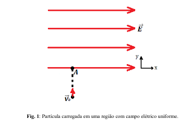
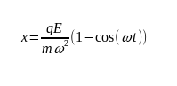
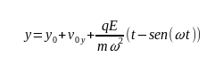
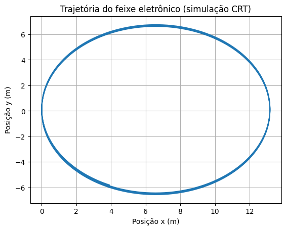

# simulacao_de_fisicac
Uma partícula carregada de carga q e massa m com velocidade inicial constante (direção vertical) entra numa região que contém um campo elétrico constante na direção horizontal,
no ponto 𝐴(𝑥0,𝑦0) em um instante 𝑡0. Depois de um determinado intervalo de tempo (∆𝑡=𝑡−𝑡0), o campo elétrico começa a girar com uma velocidade angular constante ω. Nessas condições construa a trajetória dessa partícula no plano 𝑥𝑦 depois de um tempo 𝑡>𝑡0.









## Para a simulação funcionar corretamente instale o python:
- Instale o pip:
```bash
$ python -m pip install -U pip
```
- Instale os módulos:
```bash
$ python -m pip install -U matplotlib
$ pip install numpy
```
